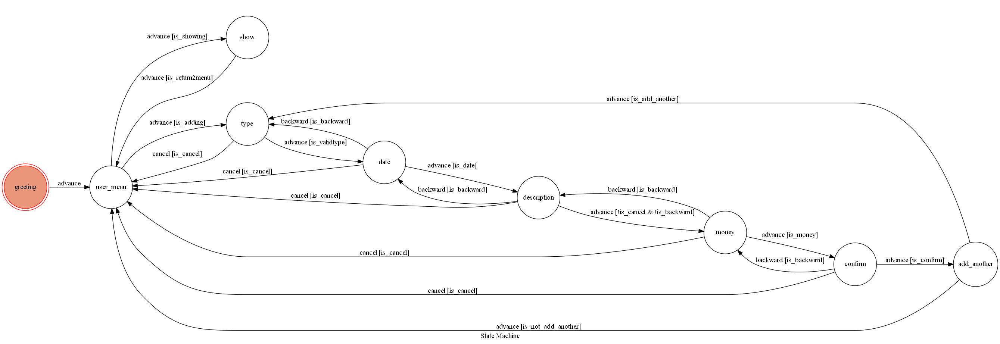

# TOC2021 財務管家
## 基本資訊
### Line bot名稱：財務管家  
### Bot basic ID：@771tnsaq  
### QR code：

## 簡介
財務管家是一款負責幫你管理收支的記帳小工具!  
可以隨時紀錄收入/支出的項目，並瀏覽年度概況。  
已經Deploy在heroku上囉!  
*由於deploy在heroku上，可能需要等待server甦醒><

## Finite State Machine

### [FSM也可至heroku查看](https://linebot-moneymanage.herokuapp.com/show-fsm)

## 用法
### 多個使用者的handle方式
以line的user_id為key的方式建立一個儲存machine的dict，當收到webhook event時先判斷目前是否已有對應的machine，若沒有則新增一個至dict中，並且每次依user_id呼叫對應的machine。
### 儲存帳本的資訊
將輸入的資訊以csv like的形式存入user_id對應的文字文件中，當machine需要寫入或讀取時即可依user_id存取。
### initial state `greeting` & `user_menu` :
初始的state設為`greeting`。
當使用者傳送任何純文字訊息時會advance至`user_menu`，
並回復一個選單可以選擇"新增記帳"、"顯示帳本"，分別advance至`type`、`show`。  

### `type` :
選擇"新增記帳"會advance至`type`，讓使用者選擇該帳目為支出或收入並advance至`date`。  
(若選擇取消則會返回`user_menu`)  

### `date` :
選擇"支出"、"收入"會advance至`date`，讓使用者選擇該帳目的日期並advance至`description`。  
(若選擇"取消"則會返回`user_menu`、"上一步"則會回到`type`)  

### `description` :
選擇帳目日期後會advance至`description`，讓使用者輸入該帳目的描述並advance至`money`。  
(若輸入"取消"則會返回`user_menu`、"上一步"則會回到`date`)  

### `money` :
在`money`可以讓使用者輸入正整數的金額，接著會advance至`confirm`。  
(若輸入"取消"則會返回`user_menu`、"上一步"則會回到`description`)  

### `confirm` :
advance至`confirm`後，讓使用者確認帳目資訊沒有錯誤，有以下選項。
* "是" : 紀錄該筆帳目，並advance至`add_another`。
* "上一步 (修改)" : 返回`money`以供修改。
* "否" : 直接捨棄該筆帳目並返回`user_menu`。

### `add_another` :
advance至`confirm`後，可以選擇"再新增一筆"或"回主選單"，分別至`type`、`user_menu`。  

### `show` :
選擇"顯示帳本"會advance至`show`，會以多個column的形式顯示近幾年年度的收支概況及累計收支，  
按下"回主選單"後返回`user_menu`。(最多十年、無紀錄及未來的年度不會顯示)  

## 開發環境
*	Windows 10 
*	python 3.6
*	pygraphviz 1.5 + graphviz 2.38.0
	(感謝stack overflow上的各路大神的wheel><)
*	transitions 0.6.9

其餘package詳見[requirements.txt](./requirements.txt)
